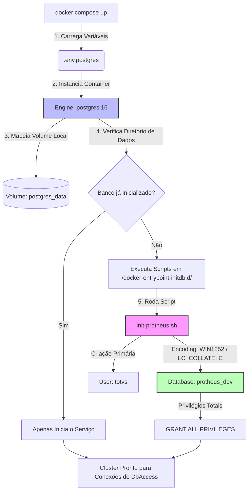

# 🐳 TOTVS Protheus - Cluster PostgreSQL Automatizado

Este repositório é um componente isolado da arquitetura TOTVS Protheus Modern DevOps [https://github.com/rodrigomicrosiga-devops/totvs-protheus-modern-devops], e isola a camada de persistência de dados do ecossistema Protheus dentro da organização **`rodrigomicrosiga-devops`**. Ele provisiona um cluster **PostgreSQL 16** totalmente automatizado, configurado nativamente com as regras de *locale* e *encoding* restritas exigidas pelo dicionário de dados da TOTVS.

---

## 🏗️ Arquitetura de Inicialização (Bootstrap)

A stack utiliza o ciclo de vida nativo do container do PostgreSQL para realizar o provisionamento da base de dados e do usuário proprietário no primeiro subset de inicialização, sem a necessidade de intervenção humana ou scripts manuais pós-deploy.



### ⚙️ Especificações Técnicas e Governança de Dados

Para garantir a integridade relacional do ERP, a inicialização força parâmetros específicos que evitam quebras de índices e erros de agrupamento de caracteres (collation) no DbAccess:

* **Encoding da Base**: `WIN1252`
* **LC_COLLATE**: `C`
* **LC_CTYPE**: `pt_BR.CP1252` (Tratamento nativo de caracteres e acentuações)
* **Persistência Volumétrica**: Nomeada via volume externo (`protheus_postgres_volume`) para blindar os dados contra deleções acidentais de containers.

### 🚀 Como Executar o Cluster

Como estamos utilizando arquivos de ambiente específicos para segregação de escopos, o deploy deve apontar explicitamente para o arquivo de credenciais do Postgres:

```bash
# Inicialização da stack isolada de banco de dados
docker compose --env-file .env.postgres up -d
```